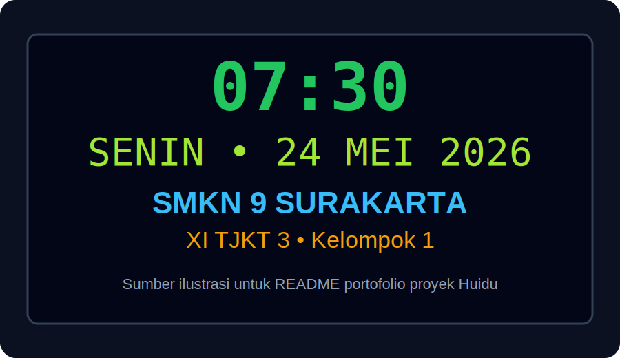

# ⏰ Proyek Jam Digital Sekolah - Huidu HD-W3A

<div align="center">


### 🏫 Portofolio Proyek Kelompok 1
**SMKN 9 SURAKARTA • XI TJKT 3**

</div>

---

## 📌 Deskripsi Proyek
Proyek ini dibuat sebagai portofolio implementasi **Jam Digital Sekolah** menggunakan controller **Huidu HD-W3A** dan software **HD2020**.  
Fokus utama proyek adalah menampilkan waktu real-time, tanggal, dan identitas sekolah pada panel LED secara rapi dan informatif.

## 👥 Identitas Tim
- 🏫 **Sekolah:** SMKN 9 SURAKARTA
- 🧑‍🎓 **Jurusan/Kelas:** XI TJKT 3
- 🤝 **Kelompok:** 1
- 🎯 **Tema:** Jam Digital Sekolah Berbasis Huidu

## 🗂️ Struktur Folder Proyek
```bash
.
├── Docs/
│   └── Presentasi-Kelompok-1-SMKN9-Surakarta.md
├── config/
│   └── hd2020-main-config.xml
├── image/
│   ├── banner-jam-digital.svg
│   └── tampilan-led-sekolah.svg
├── LICENSE
└── README.md
```

## 🖼️ Sumber Image untuk README
- `image/banner-jam-digital.svg` → banner utama portofolio.
- `image/tampilan-led-sekolah.svg` → ilustrasi tampilan LED jam digital.

### Preview


## ⚙️ Konfigurasi HD2020 (Main Setting)
File konfigurasi utama ada di:
- `config/hd2020-main-config.xml`

Isi konfigurasi mencakup:
- model controller (**HD-W3A**),
- pengaturan display,
- sinkronisasi waktu (NTP),
- dan pembagian layer teks tampilan.

## 📚 Dokumentasi Presentasi
Folder `Docs/` berisi file presentasi kelompok:
- `Docs/Presentasi-Kelompok-1-SMKN9-Surakarta.md`

Dokumen ini bisa dijadikan bahan awal untuk dibuat menjadi slide presentasi final.

---

<div align="center">

✨ **Terima kasih sudah mengunjungi portofolio proyek kami!** ✨

</div>
