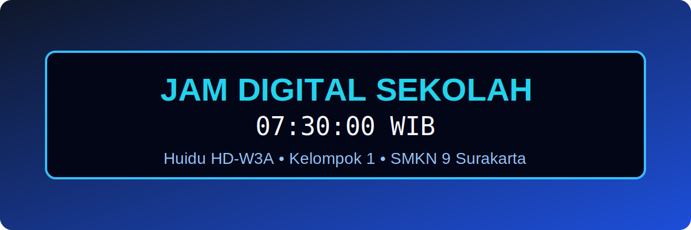
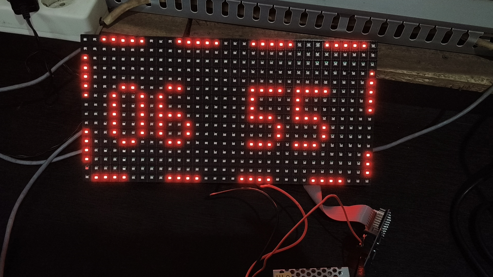
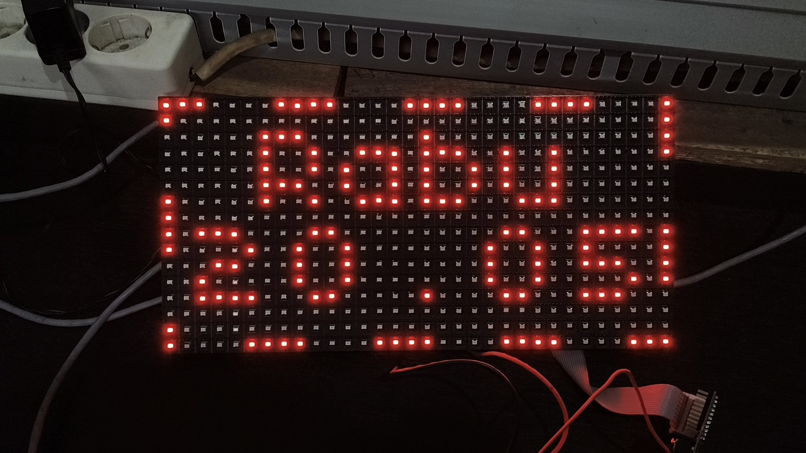
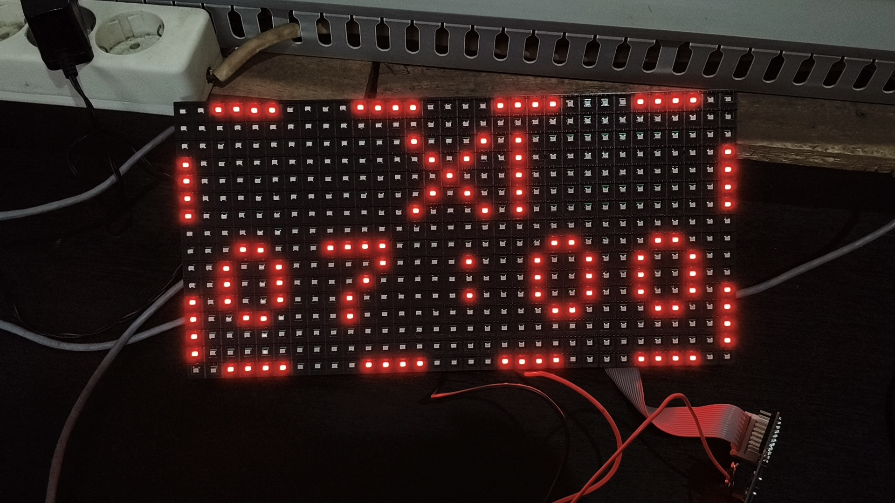
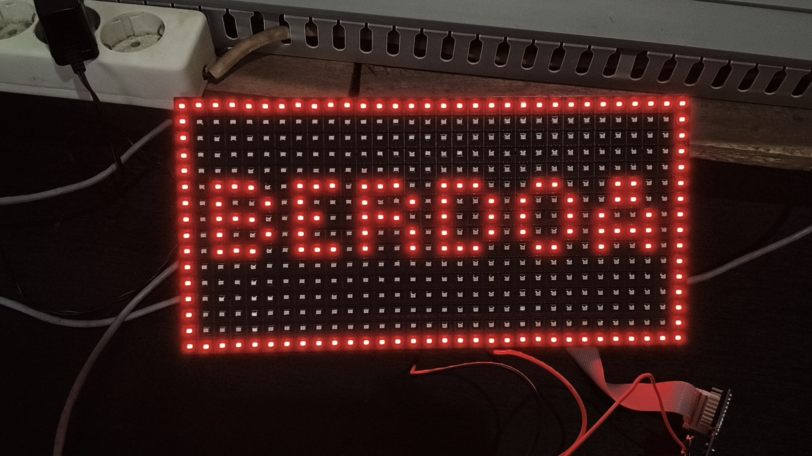
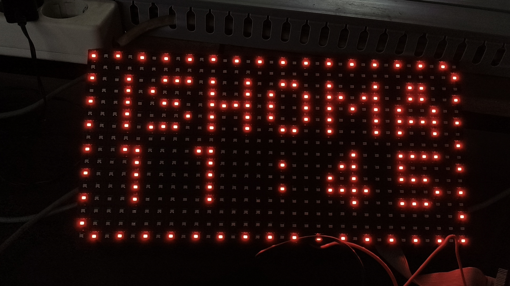

# ⏰ Proyek Jam Digital & Sistem Penjadwalan Cerdas Sekolah
**Berbasis Huidu HD-W3A & P10 LED Matrix**

<div align="center">



[](https://github.com/ellerbrock/open-source-badges/)
[](#)
[](#)
[](#)

*Portofolio Proyek Terbuka (Open Source)*  
**SMKN 9 SURAKARTA • XI TJKT 3 • Kelompok 1**

</div>

---

## 💬 Filosofi Proyek & Alasan Open Source

> *"KARYA BESAR TERLAHIR DARI RUANG KECIL"*

Kutipan yang tayang pada panel LED kami ini bukan sekadar pajangan. Ini adalah manifestasi dari logika sistem kami. Proyek ini membuktikan bahwa keterbatasan *hardware*—sebuah panel *single color* P10 berukuran sempit (32x16 piksel) dan *controller* Huidu W3A dengan memori yang sangat terbatas—bukanlah halangan. Dengan logika *routing* waktu yang ketat, optimasi *font*, dan manajemen memori yang efisien, alat yang sederhana dan "kecil" ini dapat didorong hingga batas maksimalnya untuk menciptakan sebuah mahakarya sistem yang fungsional dan kompleks.

**Mengapa kami membagikan sistem sekompleks ini secara publik?**  
Hal ini didasari oleh sebuah prinsip yang sangat kami pegang teguh:

> **خَيْرُ النَّاسِ أَنْفَعُهُمْ لِلنَّاسِ**  
> *"Sebaik-baik manusia adalah yang paling bermanfaat bagi manusia lainnya."*  
> — (HR. Ahmad, ath-Thabrani, ad-Daruquthni)

Kami berharap *source code*, algoritma jadwal, dan hasil riset kami di repositori ini bisa bermanfaat, dipelajari, dan dikembangkan lagi oleh siapa pun tanpa harus mengulang kerumitan *trial-and-error* dari titik nol.

---

## 📌 Deskripsi Proyek
Selamat datang di repositori proyek **Jam Digital Sekolah**. Proyek ini merupakan implementasi nyata dari perpaduan *hardware* dan *software* untuk menciptakan sistem informasi digital (*Digital Signage*) interaktif di lingkungan sekolah.

Menggunakan *controller* **Huidu HD-W3A** yang mendalangi panel **P10 LED Matrix**, sistem ini dirancang bukan sekadar untuk menunjukkan waktu, melainkan bertindak sebagai pengingat jadwal akademik yang dinamis. Proyek ini mendemonstrasikan bagaimana logika pemrograman jadwal divisualisasikan secara *real-time* dengan antarmuka teks yang bersih, transisi bebas *glitch*, dan optimalisasi pada perangkat berspesifikasi rendah.

---

## 👥 Identitas Tim Pengembang
Proyek ini dirancang, dikonfigurasi, dan diuji sepenuhnya oleh **Kelompok 1**. Berikut adalah struktur tim beserta peran masing-masing:

| No | Nama Anggota Tim | Presensi | Role / Tugas |
|:--:|:---|:---:|:---|
| 1 | **Angelin Mata Air P** | 08 | 👑 **Ketua Kelompok** |
| 2 | **Alwanu Zaky R** | 06 | 💻 **Programmer** *(Konfigurasi HD2020 & Logika Sistem)* |
| 3 | **Bintang Putra P** | 12 | 🔍 **Co-Programmer & Quality Assurance (QA)** |
| 4 | **Alexa Putra P** | 04 | 🔧 **Hardware & Perakitan Panel** |
| 5 | **M Ibnu Abbad** | 25 | 🔧 **Hardware & Perakitan Panel** |
| 6 | **Rafael Sukma D.R** | 31 | 🎤 **MC & Presenter** |
| 7 | **Satria Bagus P** | 34 | 🔬 **Tim Riset** |
| 8 | **Nur Kholifah H** | 27 | 📝 **Dokumentasi & Presentasi (PPT)** |
| 9 | **Sekar Anindya K** | 35 | 📝 **Dokumentasi & Presentasi (PPT)** |

---

## 🗂️ Struktur Repositori
```bash
.
├── Docs/
│   └── Presentasi-Kelompok-1-SMKN9-Surakarta.md  # Naskah/Slide presentasi resmi
├── config/
│   └── hd2020-main-config.xml                    # ⚠️ MASTER FILE PROGRAM (XML)
├── Software/
│   └── HD2020.exe                                # Installer resmi software Huidu
├── Fonts/
│   ├── 04B_03_.TTF                               # Font pixel mikro (Wajib install)
│   ├── 04B_24_.TTF                               # Font pixel pendukung
│   ├── arial.ttf                                 # Font standar rendering JWS
│   └── smalle.fon                                # Small Fonts (Anti-crash untuk JWS)
├── image/
│   ├── banner-jam-digital.svg                    # Aset visual banner
│   └── ... [Daftar file gambar dokumentasi LED]
├── LICENSE                                       # Lisensi penggunaan
└── README.md                                     # Dokumentasi ini
```

---

## 📸 Preview Tampilan LED (Real Hardware)
*Berikut adalah dokumentasi visual asli dari pengujian hardware P10 LED Matrix yang telah berhasil menjalankan sistem penjadwalan kami. Foto disusun berurutan berdasarkan siklus waktu sekolah:*

### 1. Tampilan Default (Layar Utama)
Tampilan persisten yang berputar terus-menerus selama tidak ada jadwal khusus yang menyela.
<p align="center">
  
  <br>
  
  <br>
  
</p>

### 2. Program Pagi (Masuk & Berdoa)
Program *override* yang otomatis memotong layar default tepat pada jam masuk sekolah.
<p align="center">
  
  <br>
  
  <br>
  
</p>

### 3. Program Siang (Istirahat & Ishoma)
Transisi layar penanda waktu rehat yang terkalibrasi dengan bunyi bel sekolah.
<p align="center">
  
  <br>
  
  <br>
  
</p>

---

## 🚀 Panduan Eksplorasi & Open Source

⚠️ **DISCLAIMER MODIFIKASI (MOHON DIBACA):**  
Berbeda dengan *coding* berbasis teks murni (seperti Arduino) di mana Anda bisa dengan mudah mengubah variabel atau parameter logika, pemrograman file `.xml` dari HD2020 ini menggunakan sistem blok dan *layering* visual yang sangat kompleks. 
Untuk menciptakan algoritma *Day-Specific Routing* (Jadwal otomatis bebas tabrakan antar hari), kami harus melakukan *cloning* ratusan struktur program layar murni untuk mengakali *routing time* bawaan Huidu. Modifikasi pada file ini membutuhkan tingkat ketelitian yang tinggi karena Anda harus menyesuaikan kembali limit detik dan *stay time* di setiap blok program yang tumpang tindih.

**Jika Anda tetap ingin mengopreknya, ikuti langkah berikut:**

1. **Instalasi Software:** Gunakan `HD2020.exe` yang telah kami sediakan di dalam folder `Software/`.
2. **Instalasi Font Wajib:** Sebelum membuka software, buka folder `Fonts/` lalu *install* semua *font* yang ada (`04B_03_.TTF`, `04B_24_.TTF`, `arial.ttf`, dan `smalle.fon`). Jika langkah ini dilewati, tata letak teks (*layout*) dan Modul Jam Sholat (JWS) dipastikan akan *berantakan* atau *blank* karena perbedaan kalkulasi resolusi matriks.
3. **Import File:** Buka HD2020 ➔ Pilih `File` ➔ `Import` ➔ Arahkan ke file `hd2020-main-config.xml` di dalam folder `config/`.
4. **Analisa & Modifikasi:** Anda kini bisa membedah kerumitan struktur *looping* program kelompok kami.
5. **Kirim ke Panel:** Hubungkan WiFi PC Anda ke *controller* panel, klik ikon **Sync Time**, lalu tekan **Send**.

---

<div align="center">

### ✉️ Pesan untuk Pembaca
Teruntuk Anda yang sedang menelusuri repositori ini—entah Anda adalah Bapak/Ibu Guru yang sedang menilai uji coba kami, teman sejawat yang sedang mencari referensi arsitektur *digital signage*, ataupun *developer* anonim yang kebetulan mampir:

**Jangan pernah takut untuk membongkar, merusak, dan merakit ulang sebuah sistem.** Kami percaya bahwa dokumentasi teknis yang baik adalah hak semua orang. Jika Anda menemukan *bug* jadwal atau punya efisiensi logika yang lebih brutal, jangan ragu untuk melakukan *Fork* atau *Pull Request*!

<br>

**Diciptakan dengan kebanggaan oleh Tim TJKT**  
Copyright © 2026 Kelompok 1 - SMKN 9 Surakarta. All Rights Reserved.

</div>
